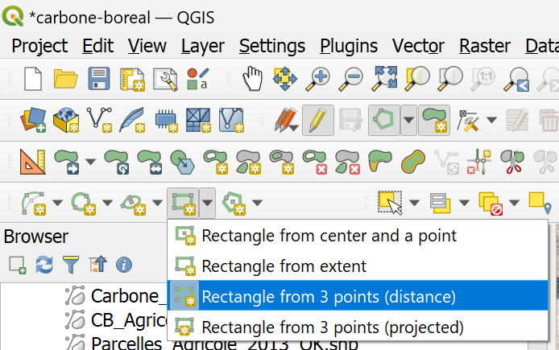

```{r setup, include=FALSE}
knitr::opts_chunk$set(echo = TRUE)
```

## Context

Drones such as the DJI P4RTK or the M300 can perform terrain follow mission where the drone will maintain a constant elevation above the surface (e.g. canopy). The elevation model used to represent the surface is called a digital surface model (DSM).

To perform such a mission a DSM file needs to be imported in the drone remote controller. The purpose of this tutorial is to show how to create such a DSM file, using open access LiDAR data from government sources.

## Define the area of interest (AOI)
We will show how to do this in QGIS.

### Add basemap
We can add a basemap as a web map service (WMS). In the *Browser* panel, create a new WMS/WMTS connection.

{width=25%}

Then, add the Québec orthophotos using this link: https://servicesmatriciels.mern.gouv.qc.ca/erdas-iws/ogc/wmts/Inventaire_Ecoforestier?request=GetCapabilities&version=1.3.0&service=WMTS

{width=50%}

### Show data
Add the orthophoto layer to your map. Then, add any additional data you have to help you select the AOI. Here, we load a polygon layer that shows tree plantations in 2013 by Carbone Boréal around Lac-St-Jean.

{width=50%}

### Draw the AOI
Create a new GeoPackage (.gpkg) vector layer, save it to a file, then make it editable by right-clicking on it and click *Toggle Editing*.

Draw a rectangle that defines the AOI. Make it larger than the area you wish to fly to give enough buffer margins for the drone. You never know, you might want to fly a larger area than what you planned when you get in the field.

{width=30%}

{width=75%}

## Find the LiDAR data
It is possible to find Québec data via the Forêt Ouverte portal. Also, the federal government aggregates all provincial data here: https://open.canada.ca/data/en/dataset/957782bf-847c-4644-a757-e383c0057995

We will use the federal data here.

Québec releases the digital terrain model (which they call MNT) and the canopy height model (MHC). These would need to be summed together to create the digital surface model (MNS, or DSM in English). Canada releases the DSM data so this means we don't have to sum it and just have to download a single raster. This is easier and faster.

Find the region, then download the data. Next, load it in QGIS. You can change the colour as we do below.

{width=40%}

## Crop the DSM to the AOI

First, we read the AOI in R. This is the rectangle we created earlier.

```{r read-aoi, messages=FALSE, warnings=FALSE}
library(stars)
aoi <- read_sf('data/aoi_dsm.gpkg')
plot(aoi)
```

Next, we crop the DSM.

```{r crop-dsm}
dsm <- read_stars('data/dsm_1m_utm19_w_20_136.tif', proxy = T)
aoi2 <- aoi %>% 
  st_transform(crs = st_crs(dsm)) # need to have the same CRS as DSM
dsm_crop <- dsm %>% 
  st_crop(aoi2)
```

## Convert to ellispoidal height
The DSM uses the most recent Canadian geoid (orthometric height). For flying a drone mission we want to have it in ellispoidal height (EPSG:4326 or WGS84) because this is the spatial reference system we'll use.

To convert it we use [GPS-H](https://webapp.csrs-scrs.nrcan-rncan.gc.ca/geod/tools-outils/gpsh.php?locale=en).

We need to find the approximate center coordinate of the AOI. We can enter 0 for height (h), as we are only interested in finding N, which is the geoid height. We use ITRF2020 as this is equal to WGS84 (EPSG:4326). We set the epoch to the approximate date when we plan to perform the mission (June 1, 2023 in this case).

```{r find-cent}
st_coordinates(st_centroid(aoi))
```

Then we enter those coordinates and information in GPS-H and calculate N.

{width=75%}

We find that N (which is the difference between ellispoidal height EPSG:4326) and the geoid is -31.522 m. This means that at this location, the geoid is 31.522 m higher than the WGS84 (or ITRF202, which is the same thing) ellipsoid.

## Convert DSM to WGS84 ellispoidal height
Now that we know N, we convert to ellispoidal height simply by substracting its value, 31.522 m, to the DSM.

```{r ellips}
dsm_crop_ellips <- dsm_crop - 31.522
```

## Export final DSM
Finally, we export the DSM, which is now in ellipsoidal height. This is the file we'll be able to import into the DJI remote controller using a microSD card.

```{r export, eval=FALSE}
write_stars(dsm_crop_ellips, 'data/dsm_crop_ellips.tif')
```
## Open in QGIS and save in EPSG:4326 / WGS84

We can open the cropped DSM (which is now in ellipsoidal height WGS84) and change the colours.

{width=75%}

Finally, we export it as a GeoTiff in ESPG:4326 in QGIS.

{width=50%}

> The DSM *must* be in EPGS:4326 (WGS84) lat/long to be used by the DJI remote controller.

