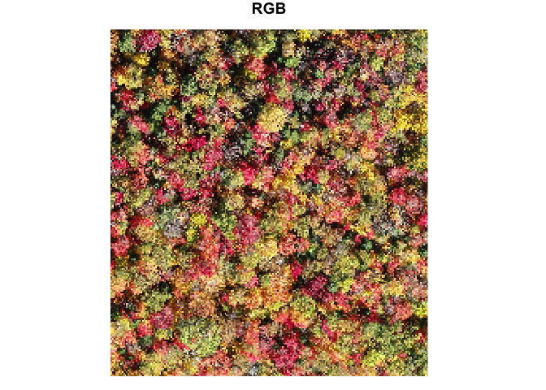
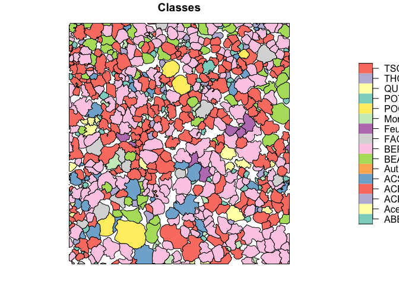
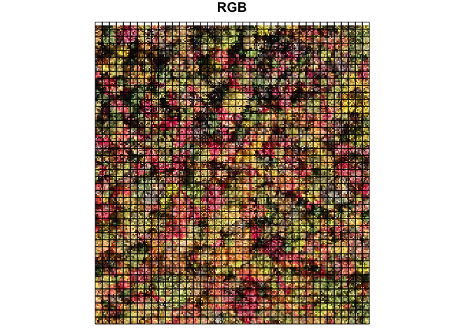
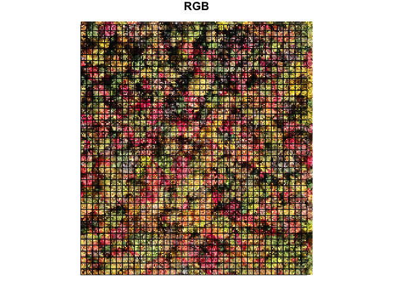
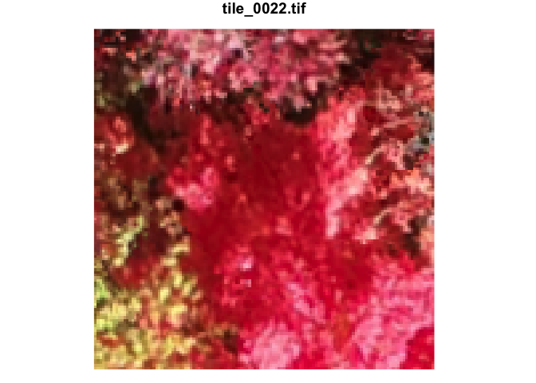
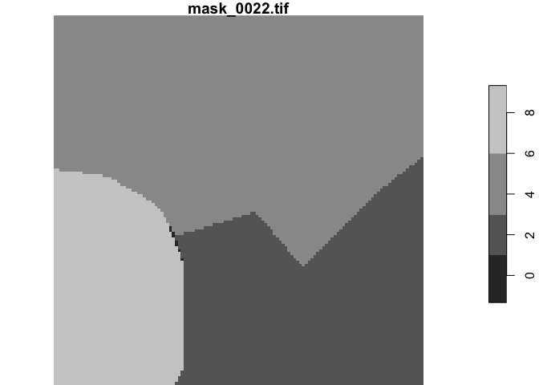

Extracting tiles and annotations from an orthomosaic to train a CNN
================
Etienne Laliberté
17/11/2021

## Background

Convolutional neural networks (CNN) can be used to map plant species
from high-resolution RGB drone imagery. A typical workflow is to acquire
imagery and create RGB orthomosaics from it, and then use this imagery
as a basemap to create annotations in vector format (e.g. polygons
outlining individual plants, identified to species).

This tutorial that the type of CNN used is one of **semantic
segmentation**. It could be adapted, however, for instance segmentation
since in this dataset, individual trees have been identified to species
as individual polygons from the imagery.

To train such a CNN, one would usually start with:

-   a high-resolution RGB orthomosaic (e.g. GeoTiff)
-   a polygon layer of species annotations (e.g. a shapefile or other
    vector format)

The goal is to create:

-   tiles of fixed size (e.g. 128 x 128 pixels) with the RGB information
    (e.g. three-band raster, as GeoTiff)
-   masks of annotations for the same area (e.g. the same region of 128
    x 128 pixels) with the species information (e.g. single-band raster,
    as GeoTiff)

## Import the orthomosaic

For this example we will use a cropped region of a high-resolution
orthomosaic for a larger region of the Station de biologie des
Laurentides (SBL). The imagery was acquired on October 7 2021, during
peak fall leaf colors.

> Note: the GeoTiff has four bands (band 4 is transparency, bands 1:3
> are RGB). We only want the RGB bands.

``` r
library(stars) # library to deal with rasters
bands_sel <- 1:3 # bands to select (RGB only)
img <- read_stars("ortho_crop.tif", # read the GeoTiff
                    proxy = TRUE) %>%  # import to not load the imagery in memory
  .[,,, bands_sel] # select only RGB
plot(img, rgb = 1:3, main = "RGB") # plot RGB orthomosaic (low res version)
```

    ## downsample set to c(24)

<!-- -->

## Import the annotations

The tree annotations are stored in a GeoPackage file. We load the data
and plot it.

``` r
species <- read_sf("trees_crop.gpkg") # read the GeoPackage containing the tree polygons ID'ed to species
plot(species["Label"], main = "Classes") # plot the tree polygons
```

<!-- -->

## Get species (and other classes) names

We now need to store a table listing all classes (mostly species), and
create a numeric column listing a number for each class. This
information needs to be kept since this will be our legend enabling us
to translate numbers to species later on.

``` r
# Get species names
library(tidyverse)
sp_names <- species %>% 
  st_drop_geometry() %>% # transform to tibble
  select(Label) %>% # keep only the Label colum
  distinct() %>% # find the unique values
  arrange(Label) %>% # sort in alphabetical order
  mutate(sp_id = as.numeric(as.factor(Label))) # create new column with number IDs for each class (mostly species)
sp_names # show the result
```

    ## # A tibble: 16 × 2
    ##    Label    sp_id
    ##    <chr>    <dbl>
    ##  1 ABBA         1
    ##  2 Acer         2
    ##  3 ACPE         3
    ##  4 ACRU         4
    ##  5 ACSA         5
    ##  6 Autres       6
    ##  7 BEAL         7
    ##  8 BEPA         8
    ##  9 FAGR         9
    ## 10 Feuillus    10
    ## 11 Mort        11
    ## 12 POGR        12
    ## 13 POTR        13
    ## 14 QURU        14
    ## 15 THOC        15
    ## 16 TSCA        16

We also edit the `species` layer to only keep one column with the
`sp_id`. The reason is that CNN want numbers.

``` r
species <- species %>%
 transmute(sp_id = as.numeric(as.factor(Label))) # we keep only one column with species numbers IDs
species # we inspect it
```

    ## Simple feature collection with 674 features and 1 field
    ## Geometry type: MULTIPOLYGON
    ## Dimension:     XY
    ## Bounding box:  xmin: 577075.2 ymin: 5093131 xmax: 577189.8 ymax: 5093257
    ## Projected CRS: WGS 84 / UTM zone 18N
    ## # A tibble: 674 × 2
    ##    sp_id                                                                    geom
    ##  * <dbl>                                                      <MULTIPOLYGON [m]>
    ##  1     8 (((577075.2 5093253, 577075.2 5093254, 577075.3 5093254, 577075.4 5093…
    ##  2     7 (((577075.2 5093252, 577075.2 5093253, 577075.5 5093253, 577075.6 5093…
    ##  3    16 (((577081.6 5093256, 577081.6 5093256, 577081.7 5093256, 577081.8 5093…
    ##  4    11 (((577077.9 5093257, 577082.3 5093257, 577082.3 5093256, 577082.3 5093…
    ##  5     8 (((577075.2 5093248, 577075.2 5093252, 577075.4 5093252, 577076.1 5093…
    ##  6     3 (((577083.6 5093248, 577083.8 5093248, 577083.8 5093248, 577083.8 5093…
    ##  7     1 (((577077.3 5093244, 577077 5093244, 577077 5093244, 577076.8 5093245,…
    ##  8     7 (((577075.2 5093245, 577075.2 5093248, 577075.3 5093248, 577075.5 5093…
    ##  9     4 (((577075.2 5093242, 577075.2 5093242, 577075.3 5093242, 577075.3 5093…
    ## 10     8 (((577075.2 5093239, 577075.2 5093241, 577075.3 5093241, 577075.5 5093…
    ## # … with 664 more rows

## Create the grid for the tiles

We need to create a grid to create the tiles that will be used to
extract the RGB data and masks.

### Find the spatial resolution of imagery

The first step is to know the resolution of the imagery, because we need
to know the distance that corresponds to the number of pixels we want to
extract.

``` r
img_xres <- abs(st_dimensions(img)[[1]]$delta) # x resolution
img_yres <- abs(st_dimensions(img)[[2]]$delta) # y resolution

# Ensure that pixels are square
round(img_xres, 3) == round(img_yres, 3) # should be TRUE
```

    ## [1] TRUE

### Define the tile size

This is an important parameter. If the CNN expect tiles 128 x 128
pixels, then this parameter should be set to 128.

``` r
n_pixels <- 128 # tile size (width/height)
```

We must now calculate, in meters, the size of a 128 x 128 tile (or cell)
in this imagery.

``` r
cell_size <- n_pixels * img_xres # 128 pixels x the size of one pixel
cell_size # 2.944 m x 2.944 m in this case
```

    ## [1] 2.944

> Note: 3 m x 3 might be a bit small to train this CNN, given the size
> of the large trees. But we keep going anyway as this is simply for
> illustration purposes.

Then, we make the grid. And we plot it over the RGB imagery to check it.

``` r
aoi_grid <- st_make_grid(img, # this uses the extent of the imagery
                         cellsize = cell_size) # we make cells the size of our 128x128 tiles
plot(img, rgb = 1:3, main = "RGB", reset = FALSE) # we plot the imagery
```

    ## downsample set to c(24)

``` r
plot(aoi_grid, add = TRUE) # we overlay the grid
```

<!-- -->

We will avoid cells which are not entirely within the bounding box of
the imagery. This can be done with the following code.

``` r
tiles_within <- st_within(aoi_grid, st_as_sfc(st_bbox(img))) # finds cells within the extent of the imagery
sel_logical = lengths(tiles_within) > 0 # returns of logical vector for those cells we keep
aoi_grid_sel <- aoi_grid[sel_logical] # we filter only those cells
```

We see the some cells at the northern and eastern margins are now
excluded.

    ## downsample set to c(24)

<!-- -->

## Extract the tiles and masks

We are now ready to extract the tiles and masks. To speed things up, we
will run this in parallel on multiple cores.

### Preparing for parallel computing

We need to prepare everything for parallel computing. This implies
telling **R** how many cores to use. We use all but one, to ensure that
we still have one core that remains free for other stuff, if needed. But
you could decide to use all available cores to speed things up further.

``` r
library(foreach)
library(doParallel)
n_cores <- detectCores() - 1 # we use all cores but one
cl <- makeCluster(n_cores) # we start the parallel cluster
registerDoParallel(cl) # we register it
clusterExport(cl, "bands_sel") # we need to export that object to all cores
```

Before starting the loop, one parameter to define is the bounding box
shrink factor for grid cell size to extract tiles. We set it to 0.0001.
See `?st_crop` for details.

``` r
crop_eps <- 0.0001
```

### First loop: list of cropped tiles

Then we run the first parallel loop. That first loop generates for every
tile (or cell) in our grid `aoi_grid_sel`, a 128 x 128 pixel RGB tile
from the imagery. The list will be as long as there are cells in our
grid. To be clear, this first step just creates the metadata and stores
it as a lit of `stars_proxy` objects.

``` r
# Loop to extract tile locations (as stars_proxy objects)
tiles_stars_proxy <- foreach(i = 1:length(aoi_grid_sel),
                             .packages = c('tidyverse', 'stars')) %dopar% {
                               
    # Extract tile i from img
    tile_i <- img %>% 
      st_crop(aoi_grid_sel[i],
              epsilon = crop_eps)
    
} # end of foreach loop for tile locations
```

### Second loop: save the RGB tiles

Then, we use this list and the second loop actually creates the very
many 128 x 128 RGB tiles extracted from the orthomosaic. They are stored
as GeoTiff files.

> Make sure that folders tiles `tiles` and `masks` are created first in
> your working directory. These are used to store the outputs.

``` r
tiles <- foreach(i = 1:length(tiles_stars_proxy),
                 .packages = c('tidyverse', 'stars')) %dopar% {
  
  # Extract tile i
  tile_i <- tiles_stars_proxy[[i]] %>% 
    # write GeoTiff
    write_stars(paste0("tiles/tile_", str_pad(i, 4, pad = "0"), ".tif"),
    type = "Byte",
            options = c("COMPRESS=LZW"))
}
```

### Third loop: extract the masks

Finally, we save the masks. We first need to set a background (class
corresponding to no annotations). We give it a value of 0 since our
species (and other classes) started at 1.

``` r
bckgnd_class <- 0
```

This loop then crops the `species` layer in small tiles and converts the
classes to a single-band raster. All of these 128 x 128 pixel masks are
then stored in a folder.

``` r
masks <- foreach(i = 1:length(aoi_grid_sel),
                 .packages = c('tidyverse', 'stars')) %dopar% {
                   
    # Extract species cell i from polygon layer             
    suppressWarnings(
        species_i <- species %>% 
           st_intersection(aoi_grid_sel[i]) )

    # Create one-band template for rasterization
    template <- tiles_stars_proxy[[i]] %>%
      st_as_stars() %>% 
      slice(band, 1)   
    
    # Set values to background class
    template[[1]][] <- bckgnd_class
    
    # Rasterize the species vector tile
    mask_i <- st_rasterize(species_i[, 'sp_id'], 
                            template) %>%
    # Export as GeoTiff
    write_stars(paste0("masks/mask_", str_pad(i, 4, pad = "0"), ".tif"),
    type = "Byte",
            options = c("COMPRESS=LZW"))
} # end foreach loop masks
```

Finally, we stop the cluster.

``` r
stopCluster(cl)
```

We now have very many tiles and masks ready to be used to train a
semantic segmentation CNN!

## Inspect the tiles and masks

The individual tiles and masks can be opened in QGIS or other GIS
software to check that everything worked well. But we can just check a
random tile and mask (we select the 22nd one).

``` r
num <- 22
tile_num <- read_stars(paste0("tiles/tile_", str_pad(num, 4, pad = "0"), ".tif"))
plot(tile_num, rgb = 1:3)
```

    ## downsample set to c(0,0,1)

<!-- -->

Finally we can look at the associated mask for that tile.

``` r
mask_num <- read_stars(paste0("masks/mask_", str_pad(num, 4, pad = "0"), ".tif"))
plot(mask_num, useRaster = FALSE)
```

<!-- -->
