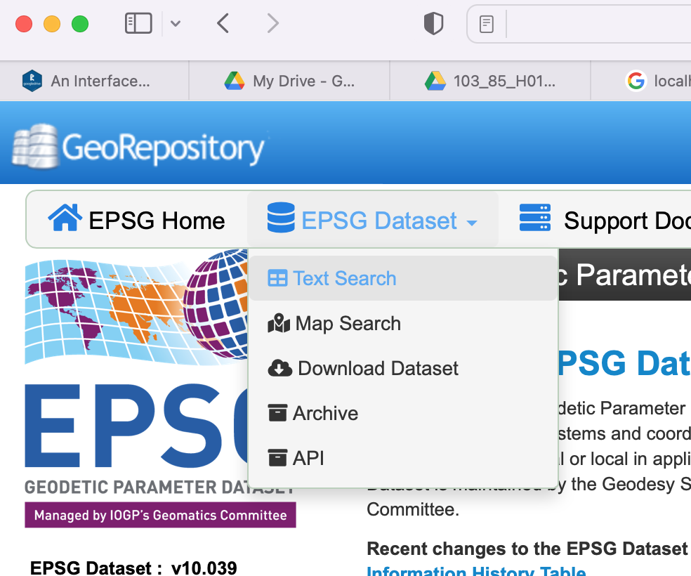

```{r setup, include=FALSE}
knitr::opts_chunk$set(echo = TRUE,
                      root.dir = '/processing/gis/orthometric_mns_reproj/')
```

# Objectifs
Dans ce tutoriel nous allons:

* reprojeter des rasters de UTM en MTM
* convertir l'élévation ellipsoïdale d'un modèle numérique de surface (MNS) en élévation orthométrique

# Mise en contexte
Dans un de nos projets, les produits de photogrammétrie (orthomosaïques et MNS) ont été créés dans le logiciel Pix4D dans le système de référence spatial (SRS) NAD83(CSRS) v2 (1997.0) car les points de contrôle utilisés pour les projets ont été acquis en mode RTK avec Can-Net. De plus, l'élévation utilisée pour le MNS est l'élévation ellipsoïdale. La projection était en UTM.

Nous voulons convertir ces produits afin que:

* la projection MTM et non UTM soit utilisée car plus précise pour d'aussi petites surfaces
* le bon code EPSG correspondant au NAD83(CSRS) en MTM soit utilisé
* Que le MNS soit en élévation orthométrique selon le géoïde canadien le plus récent

Pour montrer comment faire ceci, nous utiliserons un exemple tiré de ce projet. Il s'agit d'imagerie acquise au-dessus d'une tourbière.

# Exemple
Prenons comme exemple le site **ABT_Temiscamingue_103_85**, et la parcelle **103_85_H01**.

## Liens des fichiers à télécharger du Drive

Le dossier **Pix4D** contient l'orthomosaïque et le MNS. Les liens Google Drive de ces fichiers (orthomosaïque ou MNS) sont listés ci-dessous.

```{r lien}
lien_ortho <- "https://drive.google.com/file/d/1OPMWwVj2QSgOlGeGx5vP-DOCLuBr-SOD/view?usp=sharing"
lien_mns <- "https://drive.google.com/file/d/1W1W9br3YzHdUR7eAR80zc5XV3N8qpsWG/view?usp=sharing"
```

## Télécharger les fichiers
Pour télécharger directement un fichier de Google Drive, nous utilisons la fonction `drive_download()`. Il faut avant tout avoir installé le package `googledrive`.

> Note: Il faudra s'identifier sur Google Drive et donner les autorisations.

```{r download, eval=FALSE}
library(googledrive)
drive_download(lien_ortho)
drive_download(lien_mns)
```

## Visualiser les fichiers
Pour regarder les fichiers, on utilise le package `stars` qui lit les formats matriciels. Commençons par l'ortho.

```{r vis-ortho}
library(stars)
ortho <- read_stars('data/103_85_H01_NAD83_transparent_mosaic_group1.tif',
                    proxy = TRUE)
plot(ortho,
     rgb = 1:3)
```

On peut faire la même chose pour le MNS. Les valeurs sont des élévations ellipsoïdales en m.

```{r vis-mns}
mns <- read_stars('data/103_85_H01_NAD83_dsm.tif',
                    proxy = TRUE)
plot(mns,
     col = topo.colors(20))
```

## Inspecter les métadonnées
Regardons les codes EPSG qui sont sauvegardés. On le fait pour l'orthomosaïque, mais l'info est identique pour le MNS.

```{r ortho-epsg}
st_crs(ortho)
```

On voit à la fin que le code EPSG sauvegardé est le **EPSG:2958**. La référence officielle pour les code EPSG est ce [site web](https://epsg.org/home.html). Le code EPSG:2958 ne fait pas référence à l'époque NAD83(CSRS).


## Extraire les coordonnées du centroïde
Une façon simple et rapide de trouver la coordonnée centrale d'un raster est de créer un polygone à partir de l'étendue du raster, et de calculer le centroïde de ce polygone.

```{r mns-cent}
options(digits = 10) # pour plus de décimales montrées
centre_mns <- mns %>% # on part du raster MNS
  st_bbox() %>% # on calcule son étendue
  st_as_sfc() %>% # on convertit l'étendue en polygone
  st_centroid() # on trouve le point central de ce polygone
centre_mns # on inspecte
```

Visalisons le tout. On voit bien que le centroïde est dans le milieu de l'image. On prendra le même centroïde pour l'ortho, car ils partagent exactement la même étendue.

```{r plot-mns-centre}
plot(mns,
     col = topo.colors(20),
     reset = FALSE)
plot(centre_mns,
     col = "red",
     add = TRUE)
```

## Extraire l'élévation ellipsoïdale du point central
Pour trouver l'élévation, on utilise `st_extract()`.

En principe cette fonction est censée pouvoir extraire des valeurs d'un objet `stars_proxy` mais dans ce cas pour une raison inconnue j'obtiens un message d'erreur et **R** crash.

Je crée donc une zone tampon de 1 m autour du point central, coupe le MNS pour cette petite zone, le lis en mémoire avec `st_as_stars()` et j'extrais la valeur d'élévation du MNS. Ça fonctionne.

```{r mns-crop}
centre_buffer <- st_buffer(centre_mns, 1)
mns_elev_centr <- mns %>% 
  st_crop(centre_buffer) %>% 
  st_as_stars() %>% 
  st_extract(centre_mns)
mns_elev_centr
```

## Convertir en élévation orthométrique
On doit trouver l'ondulation du géoïde (*n*) pour cette petite région. Pour ce faire on utilise l'outil [GPS-H](https://webapp.geod.nrcan.gc.ca/geod/tools-outils/gpsh.php?locale=fr). On entre l'élévation ellipsoïdale (*h*) du point central extraite, ainsi que les coordonnées UTM en X-Y. Il faut entre la bonne zone UTM (17N dans ce cas). Il faut aussi avoir la bonne époque du NAD83(CSRS). Voir capture d'écran. Cela nous permet de voir que *n* pour cette zone est -36.137 m. Le géoïde est donc 36.137 m plus haut que l'ellipsoïde à cet endroit.

{width=50%}

## Convertir le MNS en élévation orthométrique
La conversion en orthométrique est une simple soustration de *n*. Car H = h - n.
```{r mns-h}
n <- -36.173 # ondulation du géoïde
mns_ortho <- mns - n
plot(mns_ortho,
     col = topo.colors(20))
```

On voit que l'échelle des élévations est changée.

## Trouver la bonne zone MTM
Il faut trouver la bonne zone MTM pour nos produits. On voit ci-dessous que la zone UTM 17 est à l'extrême ouest de la province.

{width=50%}

et que cela correspond à la zone MTM 10 au Québec.

{width=50%}

## Convertir en MTM
Il faut trouver le bon code EPSG correspondant à NAD83(CSRS) 1997 et MTM zone 10. Allons au site officiel des codes [EPSG](https://epsg.org/home.html). Faisons une recherche (*Text Search*).

{width=50%}

Et cherchons pour **NAD83(CSRS)**. En fouillant on trouvera que le code EPSG pour NAD83(CSRS) MTM zone 10 est le EPSG:2952. Notons qu'il n'existe pas de code EPSG en MTM pour NAD83(CSRS) qui spécifie l'époque (1997 dans notre cas). C'est donc ce code qu'on utilisera pour nos deux produits.

## Projeter en MTM
Pour reprojeter nos deux produits, il faut utiliser la fonction `st_warp()`. On spécifie le nouveau code EPSG pour la bonne zone MTM. Reprojeter un raster peut être une opération assez longue. Commençons par le MNS (en orthométrique).

```{r proj-mtm, eval = FALSE}
mns_ortho_mtm <- mns_ortho %>% 
  st_warp(crs = 2952)
```

Puis on fait la même chose avec l'orthomosaïque.
```{r proj-mtm-ortho, eval = FALSE}
ortho_mtm <- ortho %>% 
  st_warp(crs = 2952)
```

## Exporter en GeoTiff
Pour exporter en format GeoTiff, on utilise la fonction `write_stars()`. On utilise la compression LWZ pour réduire la taille du fichier. Il est important de choisir `type = "Byte"` pour l'orthomosaïque car les valeurs RGB vont de 0 à 255 et sont donc des entiers 8-bit.
```{r geotiff, eval = FALSE}
write_stars(mns_ortho_mtm, "103_85_H01_NAD83_dsm_MTM_H.tif",
            options = c("COMPRESS=LZW"))
write_stars(ortho_mtm, "103_85_H01_NAD83_ortho_MTM.tif",
            type = "Byte",
            options = c("COMPRESS=LZW"))
```

Et voilà! L'orthomosaïque et le MNS sont en MTM zone 10, et le MNS est en élévation orthométrique.